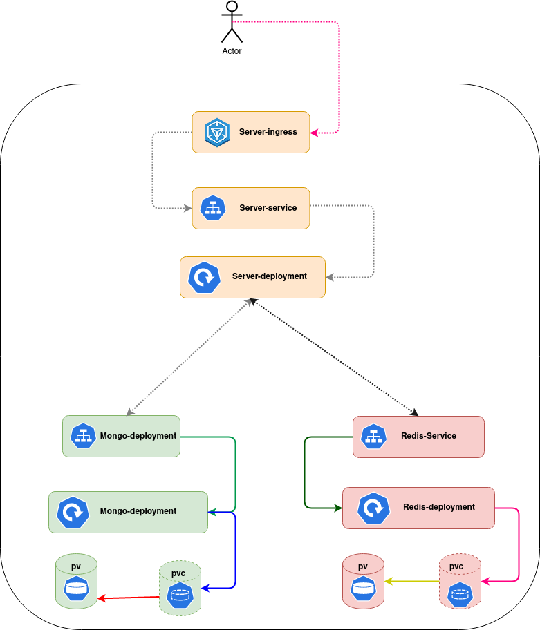
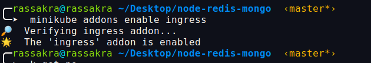
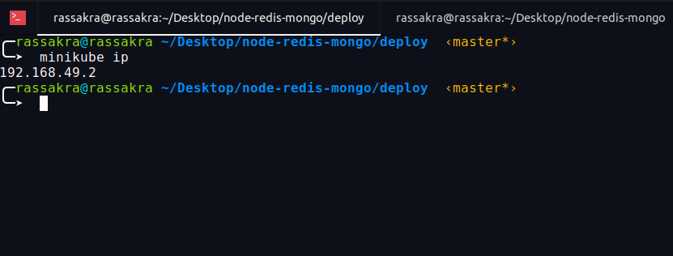
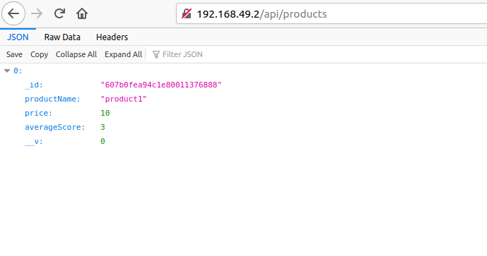
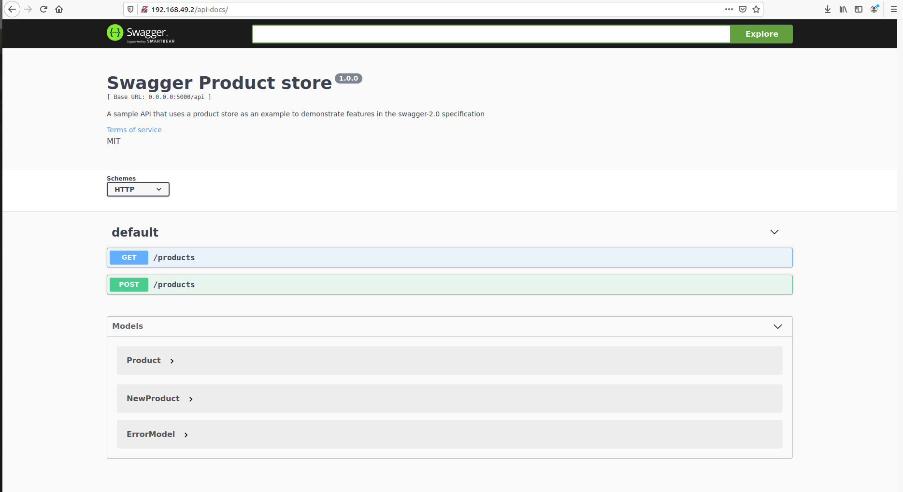
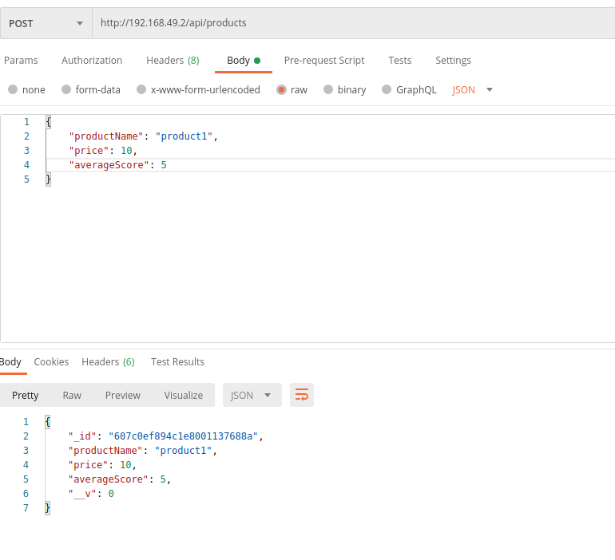
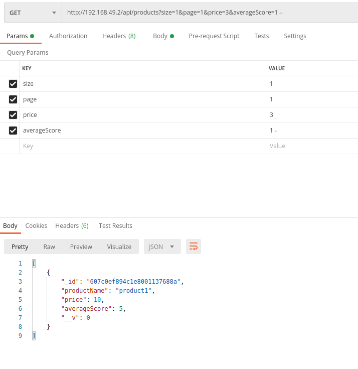
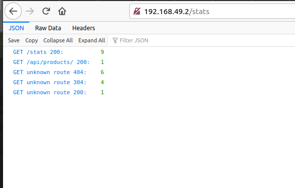

# Product Store 

[node-redis-mongo,docker,docker-compose,k8s,helm]

Product Store is a simple example of an express server with mongo, mongoose and Redis.


## Installation
```bash
git clone https://github.com/radhouen/products-store.git
cd products-store
docker-compose build
```

## Prerun configuration
1. Make sure that you have docker installed on your machine.
2. Make sure you have a docker-compose and docker cli installed
3. Make sure that you have a k8s cluster Installed locally like minikube or microk8s or a production cluster like kubeadm or Rancher.

## Run webserver
```bash
docker-compose up
```


### Run application using Kubernetes:

1. we need a deployment file for:
- redis
- mongo
- node js server

2. We need 3 services :
- Service type clusterIp to maintain the communication inside the cluster between the node server and the mongodb.
- Service type clusterIp to maintain the communication inside the cluster between the node server and the redis cache.
- Service type nodePort to make the server accessible by using the node ip address and a specific port.

3- we need an ingress :
- Create an ingress and add the url to the application on the /etc/hosts .

```bash
├── deploy
│   ├── mongo-deployment.yaml
│   ├── mongo-service.yaml
│   ├── redis-deployment.yaml
│   ├── redis-service.yaml
│   ├── server-service.yaml
│   ├── server-deployment.yaml
│   └── ingress.yaml
├── config
├── node_modules
├── routes
├── models
├──  services
├──  Dockerfile
├──  docker-compose.yaml
├──  env.sh
├──  index.js
├── README.md
├── package.json
├── bower.json (if using bower)
└── .gitignore
```

```sh
cd deploy 
kubectl create ns products
kubectl apply -f . -n products 
```

### Demo:

#### Application Architecture:




- Enable ingress for minikube:



- Get minikube ip address:




- Get the List of products :



- Display The swagger Documentation :




- Add new product :




- Display Products using pagination and filter :



- Calculate the Number of reauest comming to the server

## Improvement(TO Do ):

- we can add PV and PVC or storage class to Mongo and Redis for persistent data in case the mongo or redis pods crash.

- we can use helm chart to make the installation more easy by:
  - creating Helm charts for the server.
  - Download bitnami helm chart for redis and mongo make some custom and install it .

- Instead using kubernetes Ingress we can use a service mesh like Istio.

---

### Useful links:
[fluxcd-demo](https://betterprogramming.pub/how-to-continuously-deliver-kubernetes-applications-with-flux-cd-502e4fb8ccfe)

## License
[MIT](https://choosealicense.com/licenses/mit/)