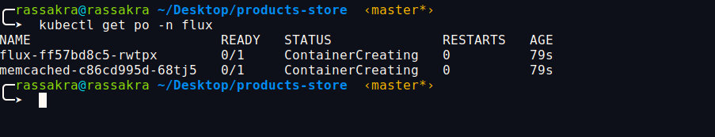
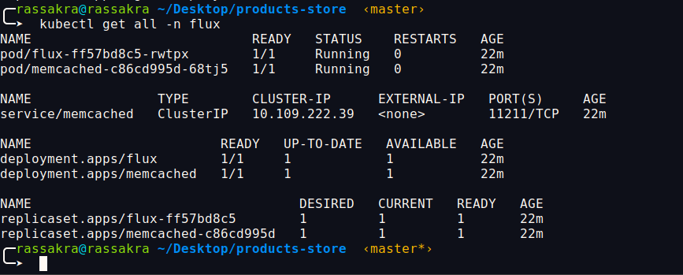
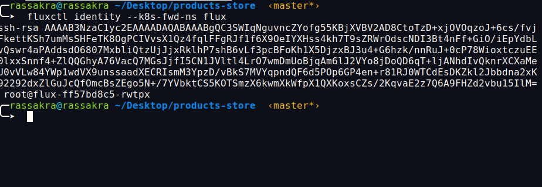
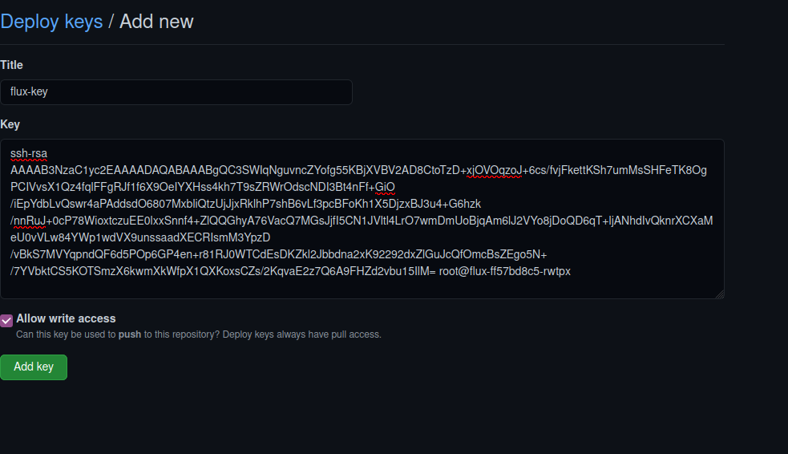
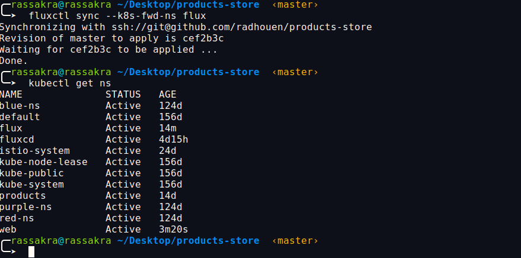
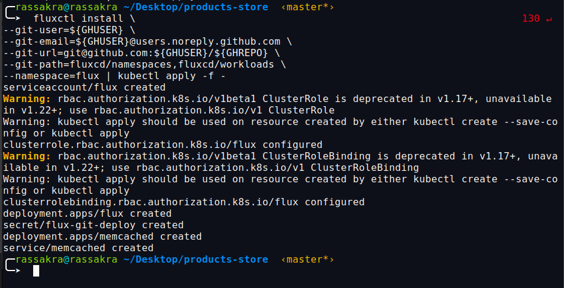
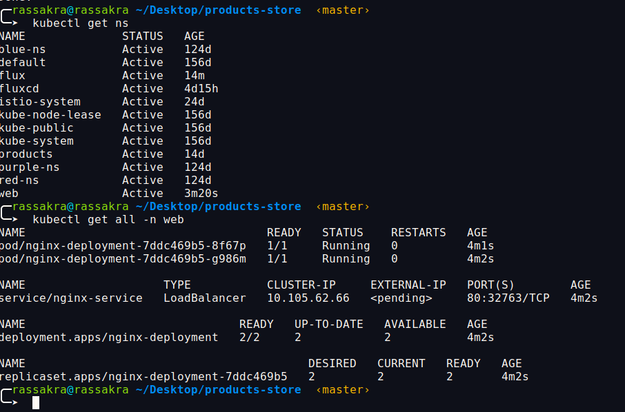

### Export Data about Gityub Repo: 

```sh
$ export GHUSER="<YOUR_GITHUB_USER>"
$ export GHREPO="<YOUR_GITHUB_REPO>"
```

#### Example:


```sh
$ export GHUSER="radhouen"
$ export GHREPO="products-store"
```

### Apply Fluxcd deployment:


```sh
$ kubectl create ns flux
namespace/flux created
$ fluxctl install \
--git-user=${GHUSER} \
--git-email=${GHUSER}@users.noreply.github.com \
--git-url=git@github.com:${GHUSER}/${GHREPO} \
--git-path=namespaces,workloads \
--namespace=flux | kubectl apply -f -
```


#### Example:

```sh
$ kubectl create ns flux
namespace/flux created
$ fluxctl install \
--git-user=${GHUSER} \
--git-email=${GHUSER}@users.noreply.github.com \
--git-url=git@github.com:${GHUSER}/${GHREPO} \
--git-path=fluxcd/namespaces,fluxcd/workloads \
--namespace=flux | kubectl apply -f -
```
Provide the name of your GitHub user within the GHUSER environment variable and the GitHub repo within the GHREPO environment variable, as shown below. Create a new namespace called flux and install the Flux CD operator in the Kubernetes cluster.

The fluxctl install command generates the required Kubernetes manifests according to the following options:

- git-user — The Git user. In this case, the GitHub username
- git-email — The Git user email. In this case, the default GitHub email
- git-url — The URL of the Git repository
- git-path — The directories within the Git repository to sync changes from
- namespace — The namespace to deploy the flux operator

### Demo : 

- Check if Flux deployment is successful:



- Get All resources from the Flux namespace:

Let’s get all resources within the flux namespace to see the current state of the objects.

As you see, there is a flux pod and a memcached pod. There is also a memcached service as the flux pod needs to interact with it.



- Authorise Flux CD to Connect to Your Git Repository

We now need to allow the Flux CD operator to interact with the Git repository, and therefore, we need to add its public SSH key to the repo.

Get the public SSH key using fluxctl.



Add the SSH key to your repository so that Flux CD can access it.

    Go to https://github.com/<YOUR_GITHUB_USER>/nginx-kubernetes/settings/keys
    Add a name to the Key in the Title section.
    Paste the SSH Key in the Key section.
    Check “Allow write access.”





- Flux CD synchronises automatically with the configured Git repository every five minutes. However, if you want to synchronise Flux with the Git repo immediately, you can use fluxctl sync, as below.



- Now let’s get the pods to see if we have two replicas of nginx







### Apply For the Node Application:

just change this steps by replacing the git path and all be the same,

```sh
```sh
$ kubectl create ns flux
namespace/flux created
$ fluxctl install \
--git-user=${GHUSER} \
--git-email=${GHUSER}@users.noreply.github.com \
--git-url=git@github.com:${GHUSER}/${GHREPO} \
--git-path=deploy \
--namespace=flux | kubectl apply -f -
```